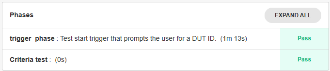
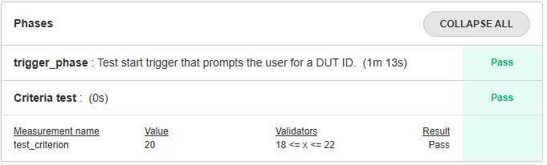
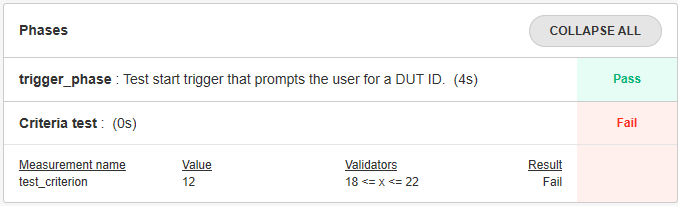

.. _criteria-label:

## Defining Test Criteria

The criteria refer to the thresholds against which measures are compared to declare a test case PASS or FAIL. In the spintop-openhtf context, the measures module implements the criteria and the comparison against the selected values.

To define a test criterion, first define an openhtf measurement object. 

```python
import openhtf as htf
criterion = htf.Measurement('test_criterion').in_range(18, 22)
```

Here the criterion defined will return a PASS if the value evaluated is between 18 and 22. The criterion name is "test_criterion" and it has been stored in the *criterion* variable.

Use the htf.measures decorator to use the defined criterion in a test case. 

```python
@htf.measures(criterion)
@plan.testcase('Criteria test')
def criteria_test(test): 
    value = 20
    test.measurements.test_criterion = 	value	
    
```

The criterion object is loaded in the openhtf measures. To evaluate a value against the test criterion, simply equate the value to the criterion. Note that the criterion name ("test_criterion") is used and not the object variable. 


Add the defined criteria and test case to your latest test bench and run it. You will see that the new test phase called *Criteria test* has passed. 

 

Hit expand all on the Phases box and see that the evaluated criteria has been added to the test phase result. 

 

Modify the value in the test case code to use a value outside of the criteria range.
```python
@plan.testcase('Criteria test')
@htf.measures(criterion)
def criteria_test(test): 
    value = *12*
    test.measurements.test_criterion = value	
    
```

Run the test bench again. The phase will now fail. 

 


:download:`Tutorial source <../tutorials/main_criteria.py>`


## Criteria types

In the example above, a range was defined to instanciate the criteria. Multiple different validator types can be used instead of the range function.

A good practice is to use a validator function which will return *True* or *False* depending on the value evaluated. For example, our range criteria can be defined in another manner as

```python
def range_validator(value):
  return 18 =< value =< 22

criterion = htf.Measurement('test_criterion').with_validator(range_validator)
```

Using the with_validator function helps you create complex criteria that match your exact needs.

For more details on the different types of criteria that can be implemented please refer the the Measurements reference

**LINK TO REFERENCE**

## Documentation

It is possible to add documentation to the criterion with the *doc()* function

```python
criterion = htf.Measurement('test_criterion').in_range(18, 22)
                    .doc('This measurement helps illustrate the criteria usage in spintop-openhtf')
```

**WHERE DOES THE DOCUMENTATION APPEAR**


## Using a criteria definition file

As we have seen in the :ref:`structure-label` tutorial , we believe it is a good practice to seperate the criteria definition from the actual test logic of the test bench. This guideline is proposed because it allows the modification and the tracking of all criteria in a single emplacement. It also eliminates the duplication of criteria. 

To this purpose, we propose to create a file called, for example, *criteria.py*. In this file a function called *get_criteria()* takes the criterion name as argument and returns the criterion which the **@htf.measures** decorator uses. 

Create the file and implement the function as described below.

```python
import openhtf as htf

def get_criteria(criterion):
	criteria_dict = {
			"test_criterion":    htf.Measurement('test_criterion').in_range(18,22)
			}
     
	return criteria_dict[criterion]

```

The python dictionary acts as a criteria switch case. The function selects the required measurement object and returns it to the caller.

In your test bench, use the function in the **@htf.measures** decorator to load the criteria and use it directly.

```python
from criteria import get_criteria

@plan.testcase('Criteria test')
@htf.measures(get_criteria('test_criterion'))
def criteria_test(test): 
    value = 20
    test.measurements.test_criterion = value	
```    

Run the test bench again and the result should be the same as was obtained above.

:download:`Tutorial source <../tutorials/main_criteria_w_file.py>`


:download:`Criteria file <../tutorials/criteria.py>`