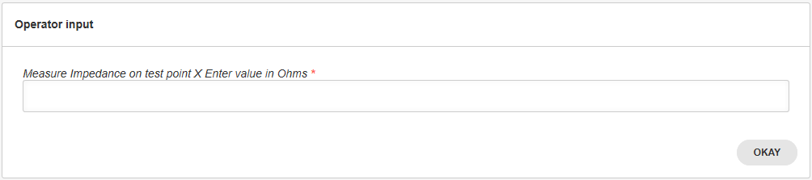

.. _extracting-data-label:

## Extracting Data from the Custom Forms Responses

The custom forms output a response in the form of a dictionary when the form display returns. The response dictionary is returned once the operator hits the Okay button.



To gather the response from the form, simply create a 'response' variable to receive the prompt return, such as illustrated below.

```python
@plan.testcase('Hello-Test')
@plan.plug(prompts=UserInput)
def hello_world(test, prompts):
    """Displays the custom from defined above"""
    response = prompts.prompt_form(FORM_LAYOUT)
```


In the case where the operator enters a value of 1200 Ohms as impedance, the dictionary returned by the will be the following:

```json
{'impedance': '1200'}
```

To access the returned value, simply index the dictionary with the key used in the form definition:

```python
    test.impedance = response['impedance']
```

To define different types of custom forms to receive types different responses, refer to the :ref:`forms-reference-label` article. 


:download:`Tutorial source <../tutorials/main_custom_forms_w_response.py>`