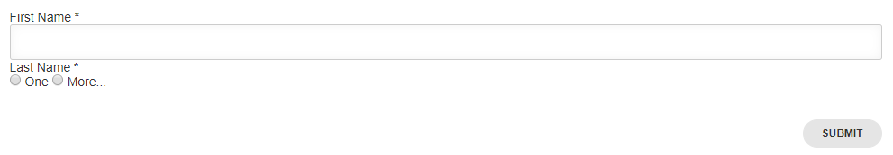

.. _forms-reference-label:

## Form Reference

This section lists the different form types that can be used in a spintop-openhtf test bench. We'll start by requesting a first and last name, in order to illustrate the different input types that are available.

### Example Form & Data

We'll start with this basic form, requesting a first and last name from the user.

```python
FORM_LAYOUT = {
    'schema':{
        'title': "First and Last Name",
        'type': "object",
        'required': ["firstname", "lastname"],
        'properties': {
            'firstname': {
                'type': "string", 
                'title': "First Name"
            },
            'lastname': {
                'type': "string", 
                'title': "Last Name"
            },
        }
    },
    'layout':[
        "firstname",
        "lastname"
    ]
}
```

This form would then successfully validate the following JSON Data:

```json
{
  "firstname": "foo",
  "lastname": "bar"
}
```

This is the dictionary that is returned when you call `UserInput.prompt_form(FORM_LAYOUT)`.


### Layout

The layout aspect of our previous example is specific to JSON Schema Forms, and, more specifically, [to the renderer we use.](https://github.com/json-schema-form/angular-schema-form/blob/master/docs/index.md#form-definitions)

#### Select Choices (Dropdown)

If we re-use the previous form and wish to limit the values allowed for a specific string field, we can use the layout attribute to impose a select field.

In the following snippet, the simple `lastname` key is replaced by a complex object which identifies the field using the `"key": "lastname"` attribute. By adding the `"type": "select"` with the `titleMap`, we impose specific choices to the user.

This does not make much sense in the case of a last name, but we use the same example for consistency.

```python
FORM_LAYOUT = {
    'schema':{
        'title': "First and Last Name",
        'type': "object",
        'required': ["firstname", "lastname"],
        'properties': {
            'firstname': {
                'type': "string", 
                'title': "First Name"
            },
            'lastname': {
                'type': "string", 
                'title': "Last Name"
            },
        }
    },
    'layout':[
        "firstname",
        {
            "key": "lastname",
            "type": "select",
            "titleMap": [
                { "value": "Andersson", "name": "Andersson" },
                { "value": "Johansson", "name": "Johansson" },
                { "value": "other", "name": "Something else..."}
            ]
        }
    ]
}
```


#### Radio Buttons

Same example with lastname:

```python

FORM_LAYOUT = {
    'schema':{
        'title': "First and Last Name",
        'type': "object",
        'required': ["firstname", "lastname"],
        'properties': {
            'firstname': {
                'type': "string", 
                'title': "First Name"
            },
            'lastname': {
                'type': "string", 
                'title': "Last Name"
            },
        }
    },
    'layout':[
        "firstname",
        {
            "key": "lastname",
            "type": "radiobuttons",
            "titleMap": [
                { "value": "one", "name": "One" },
                { "value": "two", "name": "More..." }
            ]
        }
    ]
}

```



#### Text

Adding text within the form is very useful to guide or otherwise give more information to the user. This can be done using the `"type": "help"` layout.


.. note::
    The `markdown` function was added in spintop-openhtf version 0.5.5. It transforms the text into HTML, which is the only understood format of the helpvalue.


```python
from spintop_openhtf.util.markdown import markdown

FORM_LAYOUT = {
    'schema':{
        'title': "First and Last Name",
        'type': "object",
        'required': ["firstname", "lastname"],
        'properties': {
            'firstname': {
                'type': "string", 
                'title': "First Name"
            },
            'lastname': {
                'type': "string", 
                'title': "Last Name"
            },
        }
    },
    'layout':[
        "firstname",
        {
            "type": "help",
            "helpvalue": markdown("# Well Hello There!")
        },
        "lastname
    ]
}

```


#### Images

To seamlessly serve one or more image in your custom form or prompt message, the test plan `image_url` method needs to be used. This will create a temporary url that points to the local file you are targeting and allow browsers to load this image successfully.

.. warning::
    The url returned by `image_url` is strictly temporary. It represents an in-memory mapping between the url and the filepath you specified. It follows the lifecycle of the TestPlan object, which means that as long as you keep the same test plan object, the url will live. 
    
    There are no cleanup mecanisms. However, each image is a simple key: value entry in a dictionnary, which means that its memory footprint is negligible.

```python
from spintop_openhtf.util.markdown import markdown, image_url

plan = TestPlan('examples.getting_started')

helpvalue = markdown("""

# Well Hello There


""" % plan.image_url('spinhub-app-icon.png'))


FORM_LAYOUT = {
    'schema':{
        'title': "First and Last Name",
        'type': "object",
        'required': ["firstname", "lastname"],
        'properties': {
            'firstname': {
                'type': "string", 
                'title': "First Name"
            },
            'lastname': {
                'type': "string", 
                'title': "Last Name"
            },
        }
    },
    'layout':[
        "firstname",
        {
            "type": "help",
            "helpvalue": helpvalue
        },
        {
            "key": "lastname",
            "type": "radiobuttons",
            "titleMap": [
                { "value": "one", "name": "One" },
                { "value": "two", "name": "More..." }
            ]
        }
    ]
}

```


