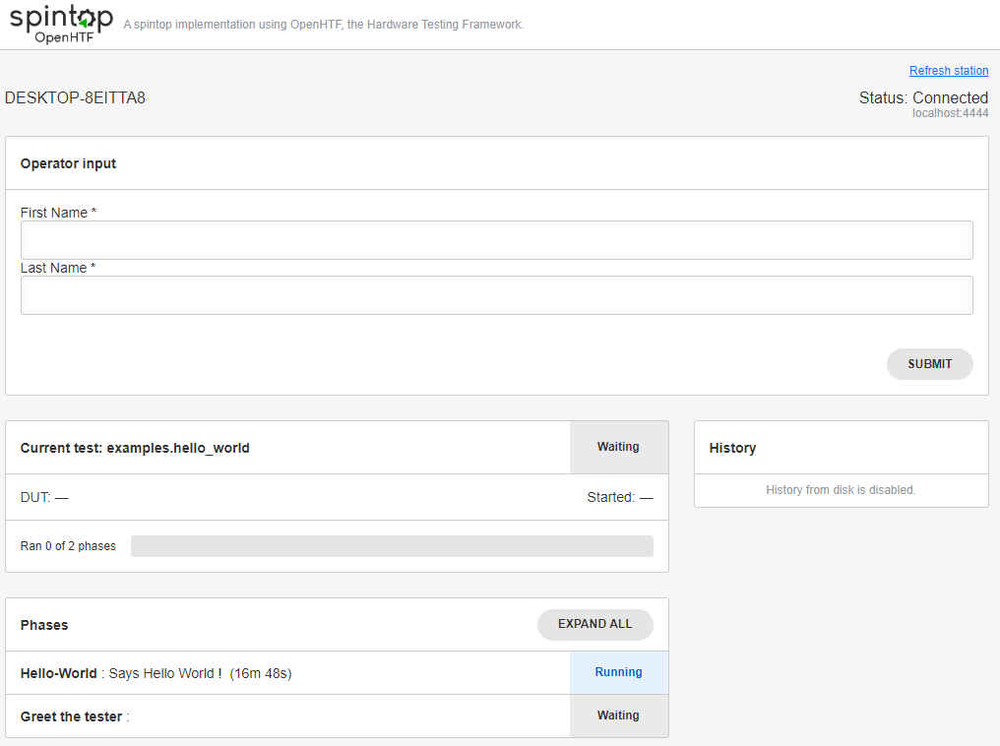
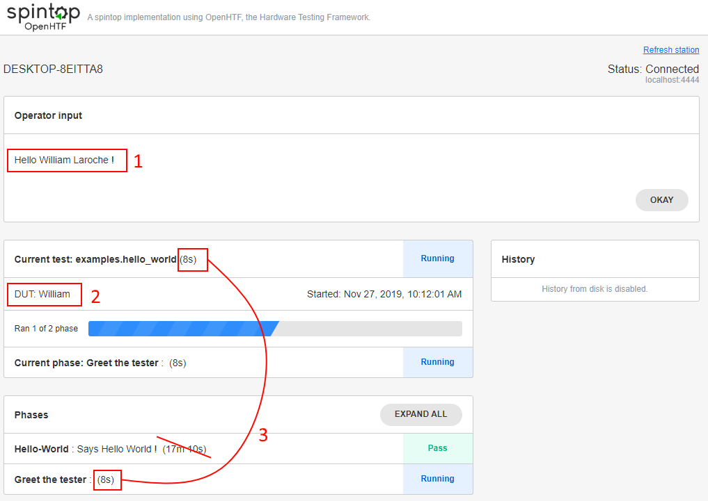

# Getting Started with spintop-openhtf

[](https://badge.fury.io/py/spintop-openhtf)

!!! summary "Summary"
    This page outlines the complete procedure to go from zero to a functionnal development testbench. We will create a simple testbench that will ask the user his first and last name and greet him afterwards. Altough this does not seem like much, it will showcase the GUI, the user interaction and the results output.

## Python Installation

To install spintop-openhtf, you need Python. We officially support **Python 3.6+** for now. If you already have Python installed on your PC, you can skip this step. Officially supported OSes are:

- **Windows 10**
    
    Install Python using the Windows Installer: [https://www.python.org/downloads/windows/](https://www.python.org/downloads/windows/)

- **Raspbian & Ubuntu**

    Install through apt-get

## IDE: VS Code with Extensions

We use and recommend Visual Studio Code for the development of spintop-openhtf testbenches. Using it will allow you to:

- Seamlessly debug with breakpoints the code you will be writting
- Remotely develop on a Raspberry Pi if you wish to
- Use a modern, extendable and free IDE

### Installation

1. [Download VS Code](https://code.visualstudio.com/download)
2. Run and follow the installation executable
3. Install the [Python Extension](https://marketplace.visualstudio.com/items?itemName=ms-python.python)

## Project Folder, Virtual Env & Installation (Windows)

First, create or select a folder where you want your sources to lie in.

Once you have your base python available, best practices are to create a virtualenv for each testbench you create. We will use `python` as the python executable, but if you installed a separate, non-path python 3 for example, you should replace that with your base executable.

Here are the installation steps on Windows:

1. Create Folder

    ```bat
    mkdir myproject
    cd myproject
    ```

2. Create venv

    ```bat
    # Creates new venv in the folder 'venv'
    python -m venv venv
    venv\Scripts\activate 
    ```

3. Install spintop-openhtf

    ```bat
    python -m pip install spintop-openhtf
    ```

You can validate that the installation succeeded using `python -m examples.hello_world`. This will run the basic OpenHTF hello world example without the spintop layer. The example will ask for the entry of a DUT ID from the user and display a passed test once it is done.

## First Steps

### First Run

Once you have an interpreter and spintop-openhtf installed, you are ready to create your first testbench. We will create a simple testbench that will ask the user his first and last name and greet him afterwards.

Create the `main.py` file in that folder.

#### (V1) `main.py`

```python
# main.py
import os

import openhtf as htf
from openhtf.plugs.user_input import UserInput
from openhtf.util import conf

from spintop_openhtf import TestPlan


""" Test Plan """

# This defines the name of the testbench.
plan = TestPlan('examples.hello_world')

@plan.testcase('Hello-World')
@plan.plug(prompts=UserInput)
def hello_world(test, prompts):
    """Says Hello World !
    
# Hello World Test
    
Welcome to the **hello world** test.
    """
    prompts.prompt('Hello World')
    test.dut_id = 'hello' # Manually set the DUT Id to same value every test

if __name__ == '__main__':
    conf.load(station_server_port='4444', capture_docstring=True)
    plan.run()

```

This is a minimum executable test that will simply output Hello World. We can run it using our virtualenv:

```bat
# Windows Activate
venv\Scripts\activate 

python main.py
```

The test should prompt a new browser page to the OpenHTF GUI. To execute the test:

1. The test first asks for a DUT id. Fill it in with something like 'test' and click Okay.
2. The test starts and greets you with Hello World. Click Okay
3. The test finishes and a new one immediately starts. You can see on the right side the PASS test in the history.

!!! summary "Output"
    

    1. This prompt is what OpenHTF calls a *trigger* phase. It is added automatically by spintop-openhtf, but may be disabled. This is what we will do in our case since there is not an actual 'DUT'. 
    2. This shows the state of the test. Note that the test is 'waiting', which means it is not started yet. This is caused by the trigger step which is a special test phase that starts the test on end. Start time of the test will be when the trigger step finished.
    3. This is the Hello-World test phase we defined. Note that the bold part is the argument passed to `testcase()` while the rest is the first line of the docstring. The rest of the docstring is written in Markdown, and will be shown when the test is executed.

### Remove DUT Prompt

Let's remove the DUT prompt to jump straight to our test:

#### (V2) `main.py`

```python

(...)

@plan.testcase('Hello-World')
@htf.plugs.plug(prompts=UserInput)
def hello_world(test, prompts):
    """Says Hello World !
    
# Hello World Test
    
Welcome to the **hello world** test.
    """
    prompts.prompt('Hello World')
    test.dut_id = 'hello' # Manually set the DUT Id to same value every test

if __name__ == '__main__':
    conf.load(station_server_port='4444', capture_docstring=True)
    # Impose no trigger.
    plan.no_trigger()
    plan.run()
```

Let's run it again:

!!! summary "Output"
    

    1. We now see our 'Hello World' prompt.
    2. The test will end when the tester clicks on the Okay button.
    3. We can see that the test is running now: this will show in test records.
    4. This is the second part of our docstring, written in Markdown. This should describe the test to the tester is necessary.

### Add a Custom Form

Spintop-OpenHTF uses json schemas to define and display custom forms. This allows test developpers to ask complex information to testers. Forms are described in detail in [the custom forms page](./custom-forms.md).

This is the `main.py` file after having added the custom form.
The form asks for the first and last name.

#### (V3) `main.py`

```python
# main.py

import os

from openhtf.plugs.user_input import UserInput
from openhtf.util import conf

from spintop_openhtf import TestPlan

FIRST_LAST_NAME_FORM = {
    'schema': { 
        'title': "First and Last Name",
        'type': "object",
        'required': ["firstname", "lastname"],
        'properties': {
            'firstname': { # key is the property named that will be returned 
                'type': "string", 
                'title': "First Name"
            },
            'lastname': {
                'type': "string", 
                'title': "Last Name"
            },
        }
    },
    # layout forces an order since python dictionnaries are unordered.
    'layout':[
        "firstname", # refers to key defined above. 
        "lastname"
    ]
}

""" Test Plan """

# This defines the name of the testbench.
plan = TestPlan('examples.hello_world')

@plan.trigger('Hello-World')
@plan.plug(prompts=UserInput)
def hello_world(test, prompts):
    """Says Hello World !
    
# Hello World Test
    
Welcome to the **hello world** test.
    """
    response = prompts.prompt_form(FIRST_LAST_NAME_FORM)
    test.dut_id = response['firstname']
    prompts.prompt('Hello {firstname} {lastname} !'.format(**response))

if __name__ == '__main__':
    conf.load(station_server_port='4444', capture_docstring=True)
    plan.run()

```


### Refactor With Trigger

At this point, we have a single test but no trigger phase. A trigger phase is strongly recommended as it allows the testbench to run indefinitely in the trigger phase without generating test records. A trigger phase can easily be added using the `@plan.trigger` decorator instead of `testcase`. 

Let's split the test in two: the trigger phase asks tester information and a single test phase greets the tester. **This requires information to be exchanged between two testcases.** The best way to do this is by defining a *Plug*. We will create a custom plug that inherits from UserInput, since we're using it's methods primarily.

!!! info
    Plugs are an OpenHTF concept. They represent reusable interfaces. The only one we've used up to now is UserInput. Example of plugs are COM Interfaces, Python Interface with the DUT, calibration context, etc.

#### (V4) `main.py` 

``` python

import os

import openhtf as htf
from openhtf.plugs.user_input import UserInput
from openhtf.util import conf

from spintop_openhtf import TestPlan

class GreetPlug(UserInput):
    """ This our custom Plug that inherits from UserInput.
    """
    FORM_LAYOUT = {
        'schema':{
            'title': "First and Last Name",
            'type': "object",
            'required': ["firstname", "lastname"],
            'properties': {
                'firstname': {
                    'type': "string", 
                    'title': "First Name"
                },
                'lastname': {
                    'type': "string", 
                    'title': "Last Name"
                },
            }
        },
        'layout':[
            "firstname",
            "lastname"
        ]
    }

    def prompt_tester_information(self):
        self.__response = self.prompt_form(self.FORM_LAYOUT)
        return self.__response
    
    def greet_tester(self):
        try:
            self.prompt('Hello {firstname} {lastname} !'.format(**self.__response))
        except AttributeError:
            # self.__response does not exist. prompt_tester_information was never called during this test.
            raise Exception("Cannot greet tester before prompt_tester_information")

""" Test Plan """

# This defines the name of the testbench.
plan = TestPlan('examples.hello_world')

@plan.trigger('Hello-World')
@plan.plug(greet=GreetPlug) # Use our custom plug. key ('greet') defines the keyword of the function
def hello_world(test, greet): # keyword 'greet' matches with @plug
    """Says Hello World !
    
# Hello World Test
    
Welcome to the **hello world** test.
    """
    response = greet.prompt_tester_information()

    # Use the tester firstname as a DUT id
    test.dut_id = response['firstname']
    
@plan.testcase('Greet the tester')
@plan.plug(greet=GreetPlug)
def greet_tester(test, greet):
    greet.greet_tester()

if __name__ == '__main__':
    conf.load(station_server_port='4444', capture_docstring=True)
    plan.run() 

```

### Final Result

#### Trigger

!!! summary "Output"
    

#### Greet

!!! summary "Output"
    

    1. We greet the user with the information entered in the trigger phase.
    2. The DUT Id was set to the firstname.
    3. The current test duration disregards the length of the trigger phase.

### Test Results Location

- **Windows**: Test results are all stored under `%localappdata%\tackv\spintop-openhtf` in the folder `openhtf-history`.

The folder is then sub-separated by test name. The test name in this example is `examples.hello_world` as defined by the creation of the TestPlan object: 
```python
plan = TestPlan('examples.hello_world')
```


