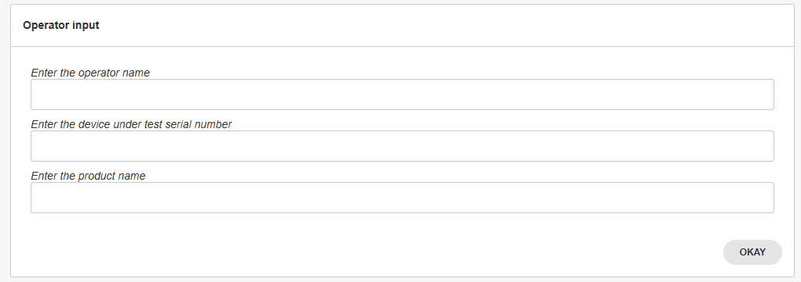
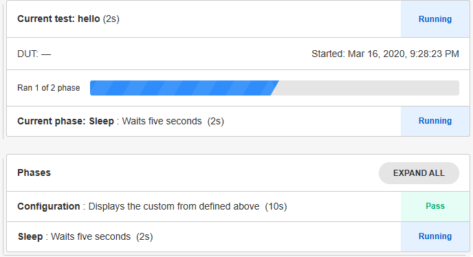

.. _custom-trigger-phase-label:

### Custom Trigger Phase

With the custom forms, it is possible to define a custom trigger phase to create a specific dynamic configuration for your test bench.

Let's first define what our trigger phase will do. The following information will be asked from the operator:

- The full operator name from a drop down list

- The Device Under Test serial number

- The tested product from a drop down list

The form is defined as the following:

```python
FORM_LAYOUT = {
    'schema':{
        'title': "Test configuration",
        'type': "object",
        'required': ["operator, uutid, product"],
        'properties': {
            'operator': {
                'type': "string", 
                'title': "Enter the operator name"
            },
            'dutid': {
                'type': "string", 
                'title': "Enter the device under test serial number"
            },
            'product': {
                'type': "string", 
                'title': "Enter the product name"
            }
        }
    },
    'layout':[
        "operator", "dutid", "product",
    ]
}
```

To call the form in the trigger phase, define a new test case, but instead of using the plan.testcase decorator, use the plan.trigger one. 
In the example below, we modified the test case used in the :ref:`extracting-data-label` tutorial to define a configuration phase to be used as a trigger, using the custom form defined above. 


```python
@plan.trigger('Configuration')
@plan.plug(prompts=UserInput)
def trigger(test, prompts):
    """Displays the configuration form"""
    response = prompts.prompt_form(FORM_LAYOUT)
    pprint (response)
```

Since the phase using the custom form is now the trigger, a new test case must be defined to implement the test bench. A simple sleep test is added for this purpose.

```python
from time import sleep

@plan.testcase('Sleep')
def sleep_test(test):
    """Waits five seconds"""
    sleep(5)
```

To run the test plan with the new trigger phase, remove the plan.no_trigger() call. 

```python
if __name__ == '__main__':
    plan.run()
```

Now run the new test plan. The test will display the following form: 



Enter the operator name, the device serial number and the product ID and hit okay. The sleep test will wait 5 seconds and terminate. The status of the two phases can be seen in the web interface.



As the test bench executes, the following verbose will be outputed on the command line.

```bat
W 01:14:11 test_executor - Start trigger did not set a DUT ID.
W 01:14:16 test_executor - DUT ID is still not set; using default.
```

This occurs because the trigger phase is designed in part to enter the DUT ID and log it in the test variables. The form has indeed asked for the DUT ID but has not logged it. Add the following line at the end of the trigger phase and rerun the test bench.

```python
    response = prompts.prompt_form(FORM_LAYOUT)
    test.dut_id = response['dutid']
```

The missing dut id verbose is gone and the id has been logged in the test variables.


:download:`Tutorial source <../tutorials/main_custom_trigger.py>`

<br/>