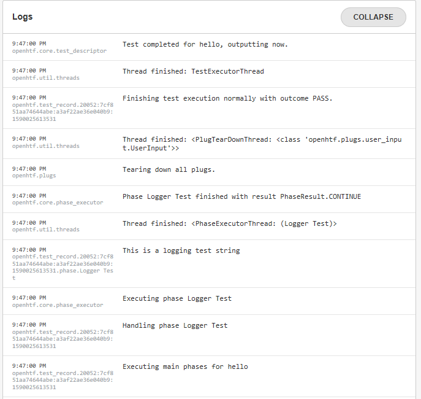

.. _logging-label:

## Logging in the Test Bench

A python logger is available in the *test* object which is passed in arguments to the test case function. Define a new test case for the logger test and setup the logger to log a test string.

```python
@plan.testcase('Logger Test')
def logger_test(test):
    test.logger.info('This is a logging test string')
```

Run the test bench to see the new string in the test logs. In the web application logger space, the logged test string can be seen. 



To better explore what is logged in a test run, we have copied below all the log strings of an execution. 


```
9:47:00 PM - openhtf.core.test_descriptor - Test completed for hello, outputting now.
9:47:00 PM - openhtf.util.threads - Thread finished: TestExecutorThread
9:47:00 PM - openhtf.test_record.20052:7cf851aa74644abe:a3af22ae36e040b9:1590025613531 - Finishing test execution normally with outcome PASS.
9:47:00 PM - openhtf.util.threads - Thread finished: <PlugTearDownThread: <class 'openhtf.plugs.user_input.UserInput'>>
9:47:00 PM - openhtf.plugs - Tearing down all plugs.
9:47:00 PM - openhtf.core.phase_executor - Phase Logger Test finished with result PhaseResult.CONTINUE
9:47:00 PM - openhtf.util.threads - Thread finished: <PhaseExecutorThread: (Logger Test)>
9:47:00 PM - openhtf.test_record.20052:7cf851aa74644abe:a3af22ae36e040b9:1590025613531.phase.Logger Test - This is a logging test string
9:47:00 PM - openhtf.core.phase_executor - Executing phase Logger Test
9:47:00 PM - openhtf.test_record.20052:7cf851aa74644abe:a3af22ae36e040b9:1590025613531 - Handling phase Logger Test
9:47:00 PM - openhtf.test_record.20052:7cf851aa74644abe:a3af22ae36e040b9:1590025613531 - Executing main phases for hello
9:47:00 PM - openhtf.test_record.20052:7cf851aa74644abe:a3af22ae36e040b9:1590025613531 - Entering PhaseGroup hello
9:47:00 PM - openhtf.core.phase_executor - Phase trigger_phase finished with result PhaseResult.CONTINUE
9:47:00 PM - openhtf.util.threads - Thread finished: <PhaseExecutorThread: (trigger_phase)>
9:47:00 PM - openhtf.plugs.user_input - Responding to prompt (d6faa8b3bf654f109a8fb6e62c076541): "{'content': {'_input': '1'}, 'option': 'OKAY'}"
9:46:55 PM - openhtf.output.servers.pub_sub - New subscriber from ::1.
9:46:53 PM - openhtf.plugs.user_input - Displaying prompt (d6faa8b3bf654f109a8fb6e62c076541): "{'schema': {'title': 'Generic Input', 'type': 'object', 'required': ['_input'], 'properties': {'_input': {'type': 'string', 'title': 'Enter a DUT ID in order to start the test.'}}}}"
9:46:53 PM - openhtf.core.phase_executor - Executing phase trigger_phase
```

For each entry is logged

- the time of the entry

- the logging module

- the log string itself

Among the log entries, can be seen the following information:

The phase executor module declaring the start and end of each phase or test cases. In the phase end entry the phase result is declared. Phases and phase results are explained further in this tutorial. 

 - openhtf.core.phase_executor - Executing phase trigger_phase

  - openhtf.core.phase_executor - Phase trigger_phase finished with result PhaseResult.CONTINUE


The added test string from our test bench 

  - openhtf.test_record.20052:7cf851aa74644abe:a3af22ae36e040b9:1590025613531.phase.Logger Test - This is a logging test string


The information regarding our user input form including the returned dictionary

  - openhtf.plugs.user_input - Displaying prompt (d6faa8b3bf654f109a8fb6e62c076541): "{'schema': {'title': 'Generic Input', 'type': 'object', 'required': ['_input'], 'properties': {'_input': {'type': 'string', 'title': 'Enter a DUT ID in order to start the test.'}}}}"


The test bench result

  - openhtf.test_record.20052:7cf851aa74644abe:a3af22ae36e040b9:1590025613531 - Finishing test execution normally with outcome PASS.


Further exploration of the logs will be done as the test flow of the test bench is explained.


:download:`Tutorial source <../tutorials/main_logger.py>`