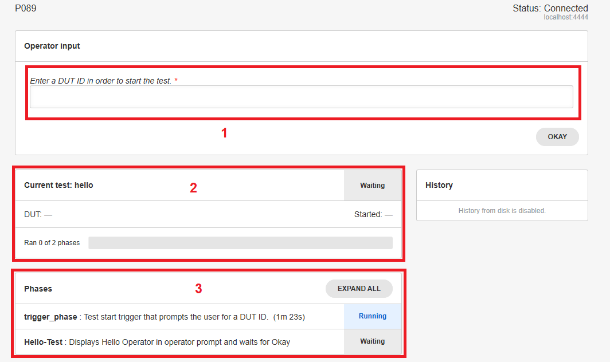
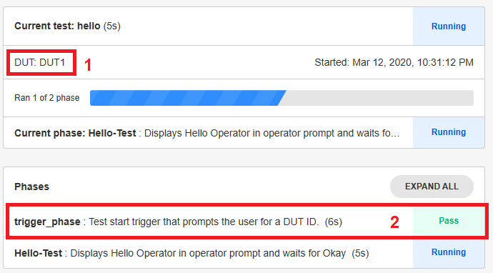

.. _trigger-phase-label:

## Trigger Phase

The trigger phase is the first phase executed in most test benches. It is a test phase which is outside of the test execution, meaning it cannot fail and does not consume test execution time. The trigger phase is added by default by spintop-openhtf. However it was disabled in our first example in the  tutorial. 

### Default Trigger Phase

Let's start the trigger phase experimentation by removing the trigger phase disable in the test bench main. Replace the main from the :ref:`first-testbench-label` tutorial example by the one below and run the bench again.

```python
if __name__ == '__main__':
    plan.run()
```

The web interface now displays the default trigger phase, asking for a DUT id to start the test.

 

 1. The DUT id is asked for in the operator input dialog. 
 2. The current test is displayed as waiting. 
 3. The Phases dialog now displays the trigger phase as well as our hello-test phase.

Enter DUT1 as the DUT id and press OK. The test will continue to the hello-test phase and display the Hello Operator! prompt.


 

 1. The DUT id is displayed.
 2. The trigger phase is marked as executed and passed.

:download:`Tutorial source <../tutorials/main_w_trigger_phase.py>`


 

